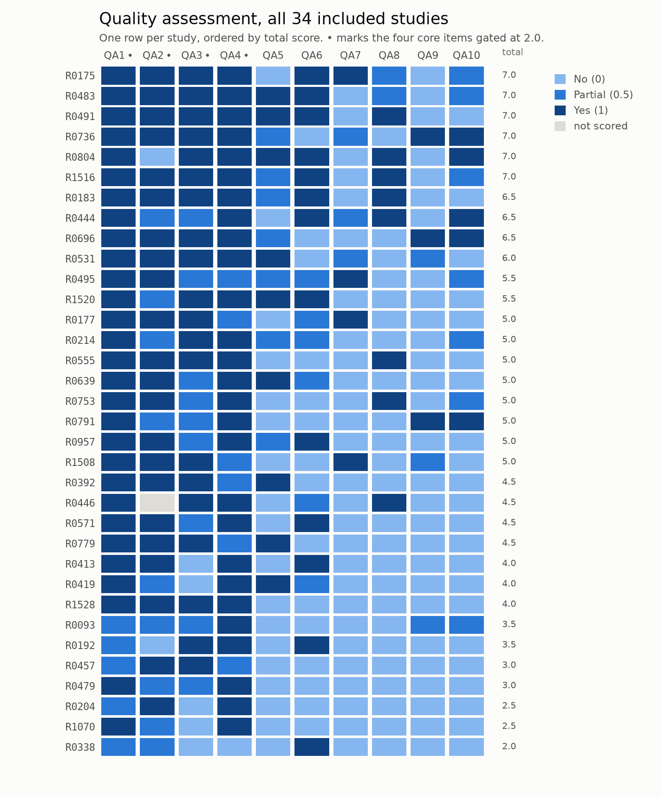
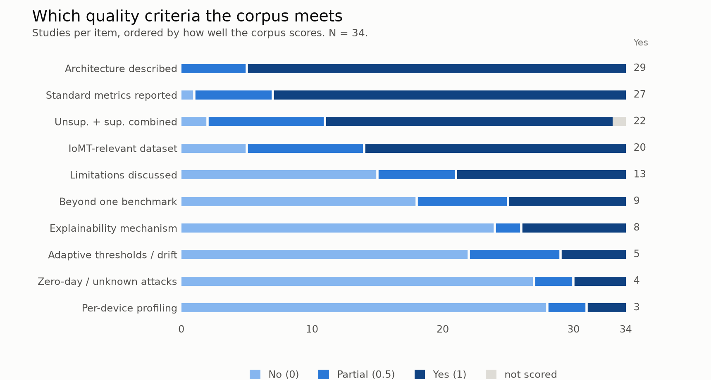
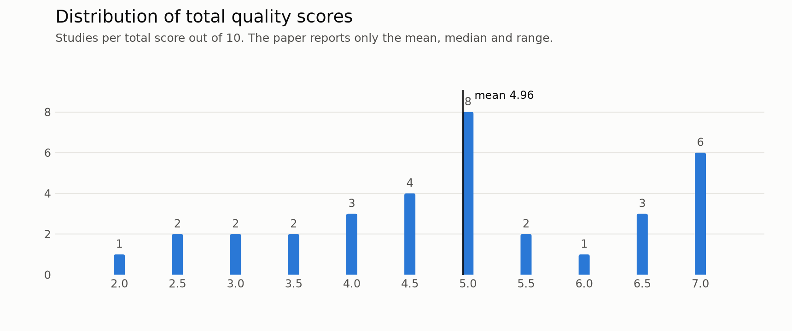

# Quality assessment at a glance

Three views of `data/03_quality_assessment_scores.csv`, rendered because CSV does not
display well in a browser. **The CSV remains the canonical record.** Nothing here is
recomputed, reweighted or reinterpreted: every cell is drawn exactly as it was coded,
and the figures regenerate from the CSV with `tools/render_qa_figures.py`.

The ten questions, their scoring rubric and which items are core are in
`data/04_quality_assessment_questions.csv`.

---

## Every study, every item



One row per included study, ordered by total score. The four core items — architecture,
integration, IoMT relevance and metrics — are marked with a dot; a study had to reach a
combined 2.0 across those four to be retained, which is why the totals column stops at
2.0 at the foot of the table.

`R0446` `QA2` is recorded as an em dash rather than a score. It is drawn as **not
scored**, in its own neutral tone, rather than folded into `No` — that cell is absent
data, not a negative finding, and the distinction is the whole point of keeping the two
apart.

## Which criteria the corpus meets



The same 340 cells read column-wise, ordered by how well the corpus scores. The shape of
this chart is the review's central observation in one image: the items the corpus
satisfies are the ones describing *what was built* — architecture, integration, datasets,
metrics — and the items it fails are the ones describing *how well it was tested*.

## Distribution of total scores



The paper reports the mean, median and range; this is the shape behind those three
numbers, including the cluster at 5.0 and the tail of six studies at 7.0.

---

## How these are made

```
python tools/render_qa_figures.py
```

Reads the two quality-assessment CSVs and writes PNG and SVG into `docs/figures/`.
Re-run it after any change to the scores so the figures cannot drift from the data.

**Design notes.** One hue, three ordered steps (`#86b6ef` → `#2a78d6` → `#104281`),
light to dark, so magnitude is legible without relying on hue discrimination. The steps
were checked for monotone lightness, adjacent-step separation and contrast against the
surface. Converted to greyscale the three levels sit at luminance 174, 107 and 58, and
"not scored" at 220, so the figures survive printing and photocopying — the levels are
told apart by lightness, never by colour alone. Vector `.svg` beside every `.png` for
anyone who wants to rescale them.
